# Stage 2. Отчет

* Теперь потоки селекторов не выполняют операций по чтению и записи, вместо них это делают executor-ы из ExecutorService.
* ExecutorService ограничен 16ю потоками (по числу селекторов), чтобы не перегружать систему. Поскольку у нас ограничены ресурсы, но пока нет ограничений по времени, задачи попадают в очередь, которая почти не ограничена по размеру (ограничена размером инта). Пока нет новых требований, считаю такую реализацию оптимальной. FIFO проще будет отлаживать и задачи не пропадут.
* Снятие сэмплов профилирощиком производилось с частотой 1 раз в 500 микро секунд (-i 500us).
* Скрипты для put и get запросов остались те же, что и на stage 1

## Результаты нагрузочного тестирования 
## PUT запросы
* Было проведено 5 тестов с помощью wrk2:
### 1. В 1 поток и 1 соединение при rate 20000. 
Сервис захлебнулся. Сервис не смог обработать такой rate и среднее время задержки было больше 2х секунд. 
### 2. В 1 поток и 1 соединение  при rate 15000. 
Среднее время задержки составило 709 наносекунд, максимальная задержка: 10 мс.

Гистограмма задержек:
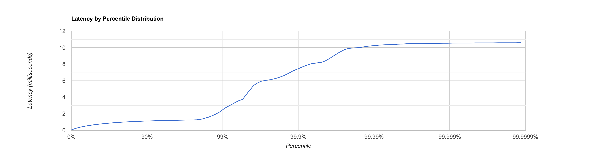

Flamegraph CPU:
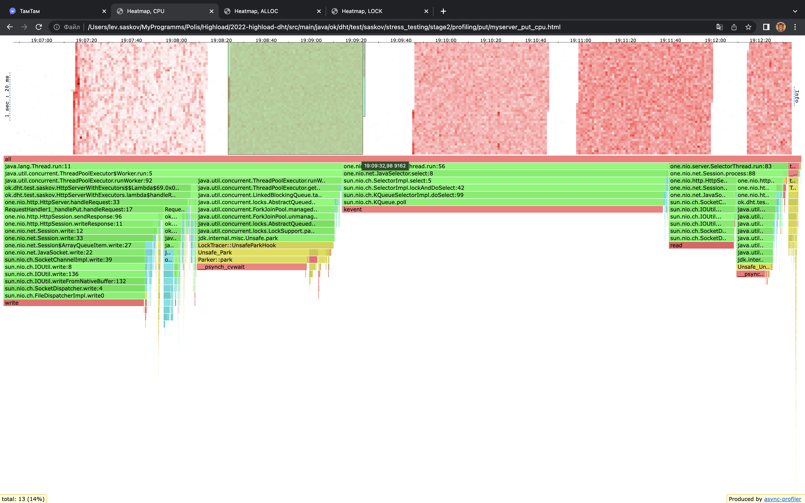
Видно, что основная часть времени была потрачена на работу селекторов и запись пакетов в сессию. На put в самой бд тратится всего 2.19 процента, это наводит на мысль о том, что хорошо бы было пересылать несколько entrys на запись в одном пакете (одной сессии), это будет гораздо эффективнее.

Flamegraph Alloc:
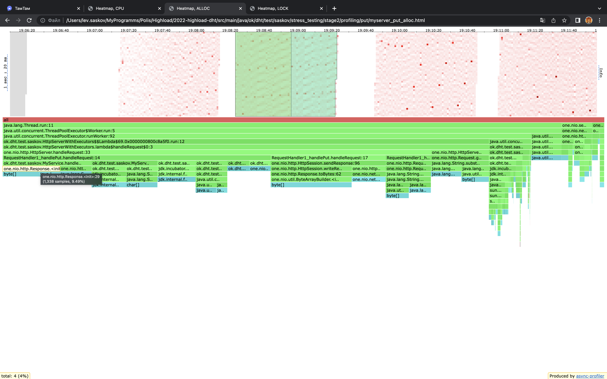
Большинство аллоков уходит на создание Responce, делаем тот же вывод, что и в cpu. 1 put запрос должен быть на запись множества entrys, а не одного. Далее идут аллоки на перевод строки в MemorySegment. Красные кубики (зоны более высокой нагрузки) - работа флашей. Флаши становятся чаще ближе к самому тесту из-за того, что я инкрементирую ключ и значение в скрипте по мере работы теста, соответственно размер entry становится все больше.

Поскольку нагрузка в 1 соединение, локов почти нет.

### 3. В 3 потока и 3 соединения при при rate 20000
Средняя задержка составила 1 мс. Максимальная 14 мс.

Гистограмма задержек:
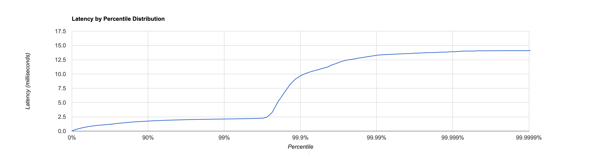

Думаю, что максимальная задержка большая из-за активной работы JIT в начале:
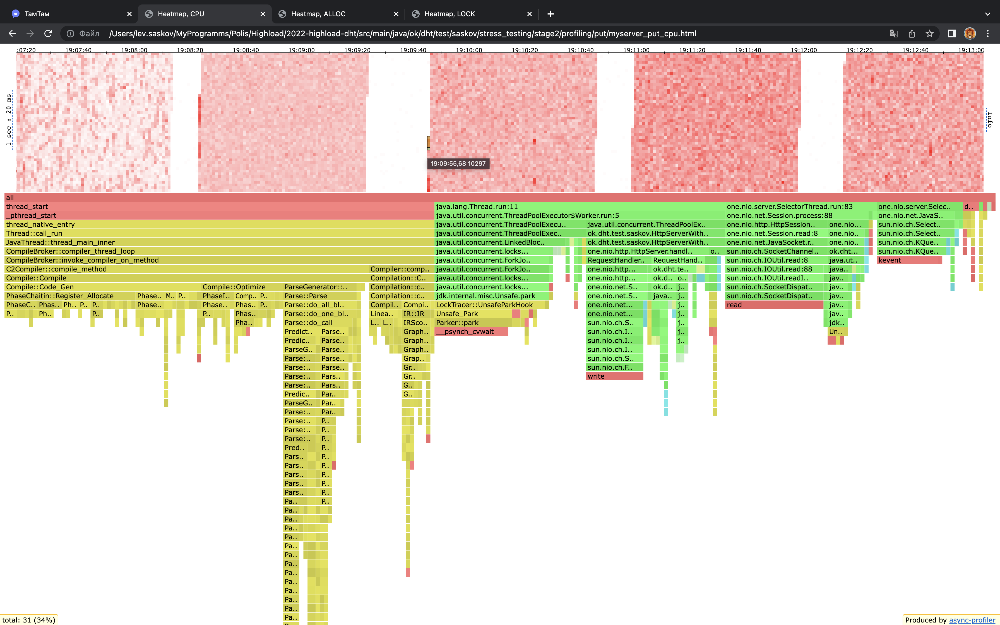

### 4. В 8 потоков и 8 соединений при rate 20000 
Средняя задержка составила 1.1 мс. Максимальная 3 мс.

Гистограмма задержек:
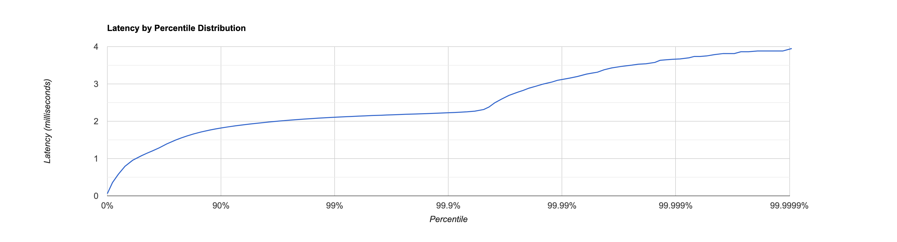

По работе CPU и alloc-ам все аналогично предыдущему тесту.

Интересно понаблюдать за локами:
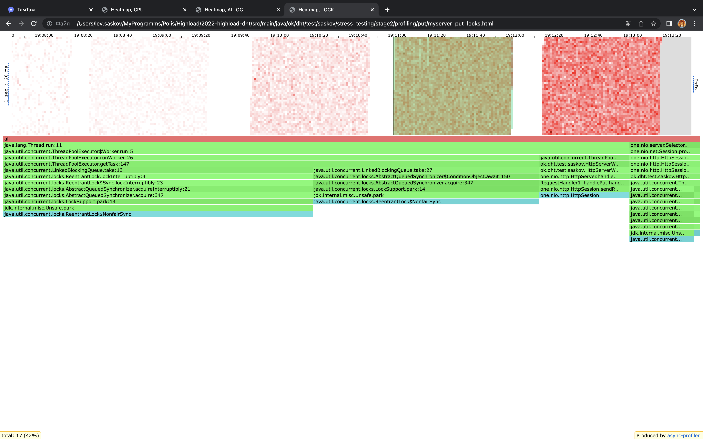
Большая часть локов происходит при взятии задач executor-ами из очереди, что логично.

### 5. В 16 потоков и 16 соединений при rate 20000
Средняя задержка составила 1 мс. Максимальная 29 мс.

Гистограмма задержек:
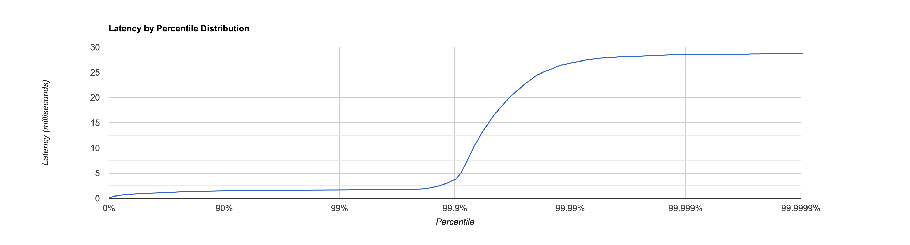

Скорее всего, рост максимальной задержки по сравнению с прошлым тестом связан с локами при обработки запросов:
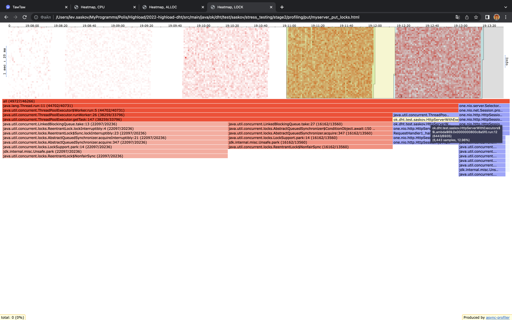

## GET запросы
Get запросы производились по базе наполненной на 2.4 гига.
Было проведено 5 тестов, все тесты проводились с rate-ом 150:
### 1. В 1 поток и 1 соединение
Среднее время задержки составило 6 мс, максимальная задержка: 44 мс.

Гистограмма задержек:
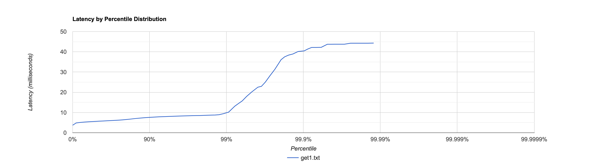

### 2. В 4 потока и 4 соединения 
Среднее время задержки составило 7 мс, максимальная задержка: 12 мс.

Гистограмма задержек:
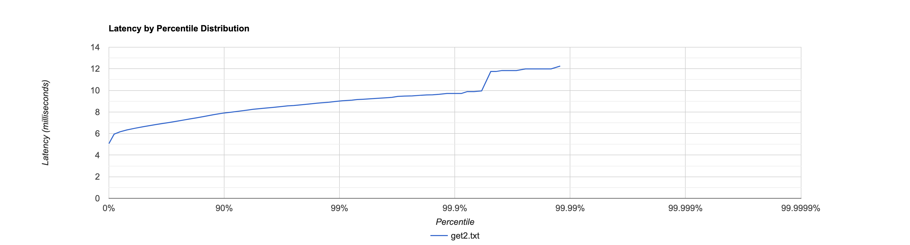

### 3 и 5. В 8 потоков и 8 соединений 
Среднее время задержки составило 12 мс, максимальная задержка: 676 мс.

Гистограмма задержек для 3-го теста:
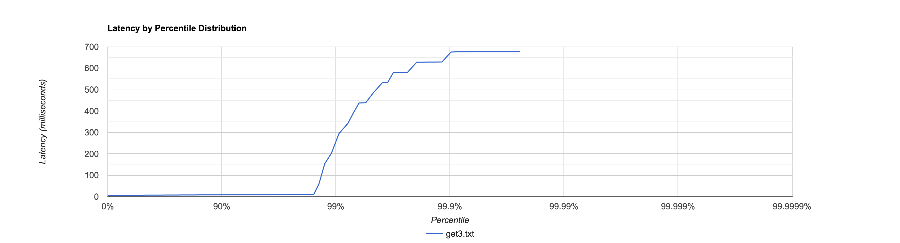

На 3-м тесте произошло что-то странное. В один момент подскочила и нагрузка на CPU и количество alloc-ов. Произошло это в методе AbstractMemorySegmentImpl#checkAccess().

Сравнение с таким же 5-м тестом (Среднее время задержки составило 7 мс, максимальная задержка: 11 мс):
CPU:
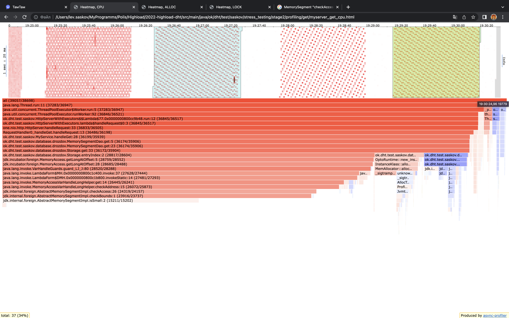
Alloc:
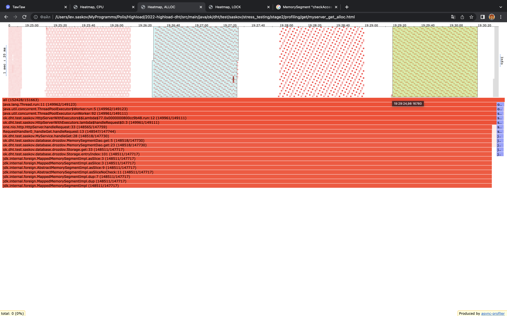

Возможно, именно поэтому MemorySegment остается в инкубаторе.

### 4. В 16 потоков и 16 соединений 
Среднее время задержки составило 8 мс, максимальная задержка: 11 мс.

Гистограмма задержек:
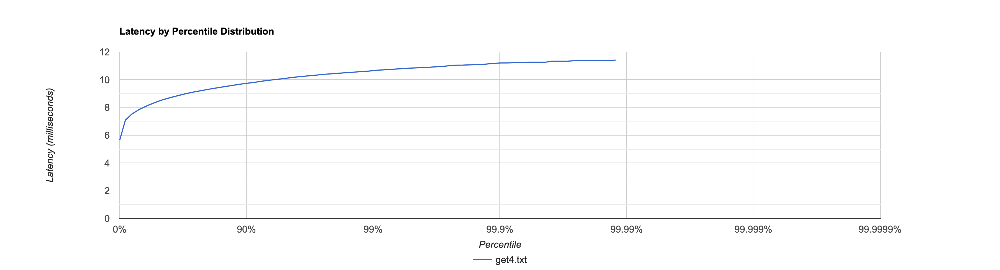

На этом тесте удобно смотреть локи:
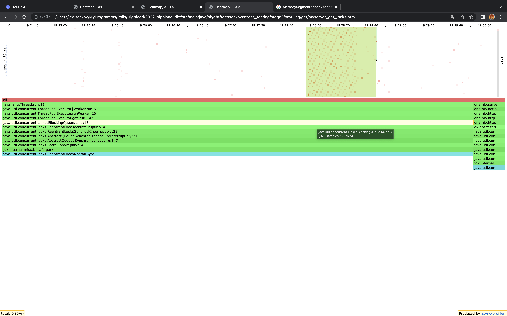
Большинство локов происходит при взятии таска executor-ами из очереди, что соответствует норме.

